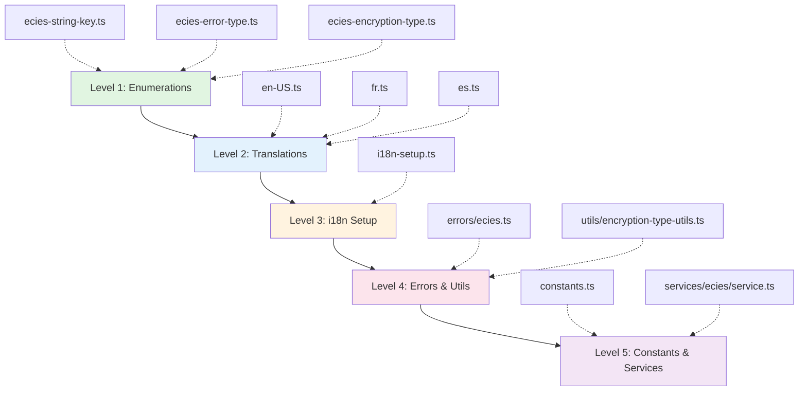

# @digitaldefiance/ecies-lib

[](https://www.npmjs.com/package/@digitaldefiance/ecies-lib)
[](https://opensource.org/licenses/MIT)
[](https://github.com/Digital-Defiance/ecies-lib)

Production-ready, browser-compatible ECIES (Elliptic Curve Integrated Encryption Scheme) library for TypeScript. Built on Web Crypto API and @noble/curves with comprehensive encryption, key management, and authentication services. Binary compatible with @digitaldefiance/node-ecies-lib for seamless cross-platform operations.

Part of [Express Suite](https://github.com/Digital-Defiance/express-suite)

**Current Version: v4.1.0**

This library implements a modern, enterprise-grade ECIES protocol (v4.0) featuring HKDF key derivation, AAD binding, and optimized multi-recipient encryption. It includes a pluggable ID provider system, memory-efficient streaming encryption, and comprehensive internationalization.

## Features

### 🛡️ Core Cryptography (Protocol v4.0)

- **Advanced ECIES**:
  - **HKDF-SHA256**: Cryptographically robust key derivation (RFC 5869).
  - **AAD Binding**: Strict binding of header metadata and recipient IDs to the encryption context to prevent tampering.
  - **Shared Ephemeral Key**: Optimized multi-recipient encryption using a single ephemeral key pair, reducing payload size.
  - **Compressed Keys**: Uses 33-byte compressed public keys for efficiency.
- **Algorithms**:
  - **Curve**: `secp256k1` for ECDH key exchange and ECDSA signatures.
  - **Symmetric**: `AES-256-GCM` for authenticated symmetric encryption.
  - **Hashing**: `SHA-256` and `SHA-512`.
- **Modes**:
  - **Simple**: Minimal overhead (no length prefix).
  - **Single**: Includes data length prefix.
  - **Multiple**: Efficient encryption for up to 65,535 recipients.

### 🆔 Identity & Management

- **Pluggable ID Providers**:
  - **Flexible IDs**: Support for `ObjectId` (12 bytes), `GUID`/`UUID` (16 bytes), or custom formats (1-255 bytes).
  - **Auto-Sync**: Configuration automatically adapts all cryptographic constants to the selected ID provider.
  - **Member System**: User abstraction with cryptographic operations, fully integrated with the configured ID provider.
- **Key Management**:
  - **BIP39**: Mnemonic phrase generation (12-24 words).
  - **HD Wallets**: BIP32/BIP44 hierarchical deterministic derivation.
  - **Secure Storage**: Memory-safe `SecureString` and `SecureBuffer` with XOR obfuscation and auto-zeroing.

### 🚀 Advanced Capabilities

- **Streaming Encryption**: Memory-efficient processing for large files (<10MB RAM usage for any file size).
- **Internationalization (i18n)**: Automatic error translation in 8 languages (en-US, en-GB, fr, es, de, zh-CN, ja, uk).
- **Runtime Configuration**: Injectable configuration profiles via `ConstantsRegistry` for dependency injection and testing.
- **Cross-Platform**: Fully compatible with Node.js 18+ and modern browsers (Chrome, Edge, Firefox, Safari).

## Installation

```bash
npm install @digitaldefiance/ecies-lib
# or
yarn add @digitaldefiance/ecies-lib
```

### Requirements

**Node.js**: 18+ (Web Crypto API built-in)
**Browsers**: Modern browsers with Web Crypto API support.

## Architecture & Protocol

### Module Dependency Architecture

The library follows a strict hierarchical module dependency structure to prevent circular dependencies and ensure reliable initialization:



**Dependency Levels:**

1. **Level 1 - Enumerations** (Pure, no dependencies)
   - Contains only TypeScript enums and type definitions
   - No imports from other project modules
   - Examples: `EciesStringKey`, `EciesErrorType`, `EciesEncryptionType`

2. **Level 2 - Translations** (Depends only on Level 1)
   - Translation objects mapping enum keys to localized strings
   - Only imports enumerations
   - Examples: `en-US.ts`, `fr.ts`, `es.ts`

3. **Level 3 - i18n Setup** (Depends on Levels 1-2)
   - Initializes the internationalization engine
   - Imports enumerations and translations
   - Example: `i18n-setup.ts`

4. **Level 4 - Errors & Utilities** (Depends on Levels 1-3)
   - Error classes with lazy i18n initialization
   - Utility functions that may throw errors
   - Examples: `errors/ecies.ts`, `utils/encryption-type-utils.ts`

5. **Level 5 - Constants & Services** (Depends on Levels 1-4)
   - Configuration constants and validation
   - Business logic and cryptographic services
   - Examples: `constants.ts`, `services/ecies/service.ts`

**Key Principles:**

- **Enumerations are pure**: No imports except TypeScript types
- **Translations are data-only**: Only import enumerations
- **Errors use lazy i18n**: Translation lookup deferred until message access
- **Constants validate safely**: Early errors use basic Error class with fallback messages

### ECIES v4.0 Protocol Flow

The library implements a robust ECIES variant designed for security and efficiency.

1. **Key Derivation (HKDF)**:
   Shared secrets from ECDH are passed through **HKDF-SHA256** to derive the actual symmetric encryption keys. This ensures that the resulting keys have uniform distribution and are resistant to weak shared secrets.

   ```typescript
   SymmetricKey = HKDF(
     secret: ECDH(EphemeralPriv, RecipientPub),
     salt: empty,
     info: "ecies-v2-key-derivation"
   )
   ```

2. **Authenticated Encryption (AAD)**:
   All encryption operations use **AES-256-GCM** with Additional Authenticated Data (AAD).
   - **Key Encryption**: The Recipient's ID is bound to the encrypted key.
   - **Message Encryption**: The Message Header (containing version, algorithm, ephemeral key, etc.) is bound to the encrypted payload.
   This prevents "context manipulation" attacks where an attacker might try to swap recipient IDs or modify header metadata.

3. **Multi-Recipient Optimization**:
   Instead of generating a new ephemeral key pair for every recipient, the sender generates **one** ephemeral key pair for the message.
   - The ephemeral public key is stored once in the header.
   - A random "Message Key" is generated.
   - This Message Key is encrypted individually for each recipient using the shared secret derived from the single ephemeral key and the recipient's public key.

### ID Provider System

The library is agnostic to the format of unique identifiers. The `IdProvider` system drives the entire configuration:

- **ObjectIdProvider** (Default): 12-byte MongoDB-style IDs.
- **GuidV4Provider**: 16-byte raw GUIDs.
- **UuidProvider**: 16-byte UUIDs (string representation handles dashes).
- **CustomIdProvider**: Define your own size (1-255 bytes).

When you configure an ID provider, the library automatically:

- Updates `MEMBER_ID_LENGTH`.
- Updates `ECIES.MULTIPLE.RECIPIENT_ID_SIZE`.
- Validates that all internal constants are consistent.

## Quick Start

### 1. Basic Configuration & Usage

```typescript
import { 
  ECIESService, 
  getEciesI18nEngine, 
  createRuntimeConfiguration, 
  ObjectIdProvider 
} from '@digitaldefiance/ecies-lib';

// 1. Initialize i18n (required once)
getEciesI18nEngine();

// 2. Configure (Optional - defaults to ObjectIdProvider)
const config = createRuntimeConfiguration({
  idProvider: new ObjectIdProvider()
});

// 3. Initialize Service
const ecies = new ECIESService(config);

// 4. Generate Keys
const mnemonic = ecies.generateNewMnemonic();
const { privateKey, publicKey } = ecies.mnemonicToSimpleKeyPair(mnemonic);

// 5. Encrypt & Decrypt
const message = new TextEncoder().encode('Hello, Secure World!');
const encrypted = await ecies.encryptSimpleOrSingle(false, publicKey, message);
const decrypted = await ecies.decryptSimpleOrSingleWithHeader(false, privateKey, encrypted);

console.log(new TextDecoder().decode(decrypted)); // "Hello, Secure World!"
```

### 2. Using Custom ID Providers (e.g., GUID)

```typescript
import { 
  createRuntimeConfiguration, 
  GuidV4Provider, 
  ECIESService 
} from '@digitaldefiance/ecies-lib';

// Configure to use 16-byte GUIDs
const config = createRuntimeConfiguration({
  idProvider: new GuidV4Provider()
});

const ecies = new ECIESService(config);
const id = config.idProvider.generate(); // Returns 16-byte Uint8Array
```

### 3. Streaming Encryption (Large Files)

Encrypt gigabytes of data with minimal memory footprint (<10MB).

```typescript
import { ECIESService, EncryptionStream } from '@digitaldefiance/ecies-lib';

const ecies = new ECIESService();
const stream = new EncryptionStream(ecies);

// Assuming 'fileStream' is a ReadableStream from a File object
async function processFile(fileStream: ReadableStream, publicKey: Uint8Array) {
  const encryptedChunks: Uint8Array[] = [];
  
  // Encrypt
  for await (const chunk of stream.encryptStream(fileStream, publicKey)) {
    encryptedChunks.push(chunk.data);
    // In a real app, you'd write 'chunk.data' to disk or upload it immediately
  }
  
  return encryptedChunks;
}
```

### 4. Member System

The `Member` class provides a high-level user abstraction that integrates keys, IDs, and encryption.

```typescript
import { Member, MemberType, EmailString } from '@digitaldefiance/ecies-lib';

// Create a new member (ID generated automatically based on configured provider)
const { member, mnemonic } = Member.newMember(
  ecies,
  MemberType.User,
  'Alice',
  new EmailString('alice@example.com')
);

console.log(member.id); // Uint8Array (size depends on provider)

// Encrypt data for this member
const encrypted = await member.encryptData('My Secrets');
```

## API Reference

### Core Services

- **`ECIESService`**: The main entry point for encryption/decryption operations.
- **`EciesCryptoCore`**: Low-level cryptographic primitives (keys, signatures, ECDH).
- **`EciesMultiRecipient`**: Specialized service for handling multi-recipient messages.
- **`EciesFileService`**: Helper for chunked file encryption.
- **`PasswordLoginService`**: Secure authentication using PBKDF2 and encrypted key bundles.

### Configuration & Registry

- **`Constants`**: The default, immutable configuration object.
- **`ConstantsRegistry`**: Manages runtime configurations.
  - `register(key, config)`: Register a named configuration.
  - `get(key)`: Retrieve a configuration.
- **`createRuntimeConfiguration(overrides)`**: Creates a validated configuration object with your overrides.

### Secure Primitives

- **`SecureString` / `SecureBuffer`**:
  - Stores sensitive data in memory using XOR obfuscation.
  - `dispose()` method to explicitly zero out memory.
  - Prevents accidental leakage via `console.log` or serialization.

## Documentation

### Architecture & Design

- **[ECIES V4 Architecture](docs/ECIES_V4_ARCHITECTURE.md)** - Protocol specification and cryptographic design
- **[Streaming Encryption Architecture](docs/STREAMING_ENCRYPTION_ARCHITECTURE.md)** - Memory-efficient streaming design
- **[Circular Dependency Prevention](docs/CIRCULAR_DEPENDENCY_PREVENTION.md)** - Module dependency architecture

### Developer Guides

- **[Contributing Guide](docs/CONTRIBUTING.md)** - How to contribute to the project
- **[Module Import Rules](docs/MODULE_IMPORT_RULES.md)** - Quick reference for import rules
- **[Migration Guide v3.7](docs/MIGRATION_GUIDE_v3.7.md)** - Upgrading from v3.x to v4.x

### Quick References

- **[Streaming API Quickstart](docs/STREAMING_API_QUICKSTART.md)** - Get started with streaming encryption
- **[V2 Quickstart](docs/V2_QUICKSTART.md)** - Quick start guide for v2.x architecture

## Development

### Avoiding Circular Dependencies

This library maintains a strict module hierarchy to prevent circular dependencies. When contributing, follow these rules:

#### Import Rules by Module Type

**Enumerations** (`src/enumerations/*.ts`):
- ✅ **CAN** import: TypeScript types only
- ❌ **CANNOT** import: Translations, i18n, errors, constants, services, utilities

**Translations** (`src/translations/*.ts`):
- ✅ **CAN** import: Enumerations, external libraries
- ❌ **CANNOT** import: i18n setup, errors, constants, services

**i18n Setup** (`src/i18n-setup.ts`):
- ✅ **CAN** import: Enumerations, translations, external libraries
- ❌ **CANNOT** import: Errors, constants, services

**Errors** (`src/errors/*.ts`):
- ✅ **CAN** import: Enumerations, i18n setup, external libraries
- ❌ **CANNOT** import: Constants, services (except as lazy imports)
- ⚠️ **MUST** use lazy i18n initialization (translation lookup on message access, not in constructor)

**Utilities** (`src/utils/*.ts`):
- ✅ **CAN** import: Enumerations, i18n setup, errors, external libraries
- ❌ **CANNOT** import: Constants, services (except as lazy imports)

**Constants** (`src/constants.ts`):
- ✅ **CAN** import: Enumerations, errors, utilities, external libraries
- ❌ **CANNOT** import: Services
- ⚠️ **MUST** handle early initialization errors gracefully (use fallback messages)

**Services** (`src/services/**/*.ts`):
- ✅ **CAN** import: All of the above
- ⚠️ **SHOULD** avoid circular dependencies with other services

#### Detecting Circular Dependencies

The project uses `madge` to detect circular dependencies. Run these commands to check:

```bash
# Check for circular dependencies in the entire project
npx madge --circular --extensions ts src/index.ts

# Check a specific module
npx madge --circular --extensions ts src/enumerations/index.ts

# Generate a visual dependency graph
npx madge --image graph.svg --extensions ts src/index.ts
```

#### Common Patterns to Avoid

**❌ Bad: Enumeration importing error class**
```typescript
// src/enumerations/ecies-encryption-type.ts
import { ECIESError } from '../errors/ecies'; // Creates circular dependency!

export function validateType(type: EciesEncryptionTypeEnum): void {
  if (!isValid(type)) {
    throw new ECIESError(ECIESErrorTypeEnum.InvalidEncryptionType);
  }
}
```

**✅ Good: Move validation to utility module**
```typescript
// src/enumerations/ecies-encryption-type.ts
export enum EciesEncryptionTypeEnum {
  Simple = 33,
  Single = 66,
  Multiple = 99,
}

// src/utils/encryption-type-utils.ts
import { ECIESError } from '../errors/ecies';
import { EciesEncryptionTypeEnum } from '../enumerations/ecies-encryption-type';

export function validateType(type: EciesEncryptionTypeEnum): void {
  if (!isValid(type)) {
    throw new ECIESError(ECIESErrorTypeEnum.InvalidEncryptionType);
  }
}
```

**❌ Bad: Error class with eager i18n initialization**
```typescript
// src/errors/ecies.ts
export class ECIESError extends Error {
  constructor(type: ECIESErrorTypeEnum) {
    const engine = getEciesI18nEngine(); // May not be initialized yet!
    super(engine.translate(EciesComponentId, getKeyForType(type)));
  }
}
```

**✅ Good: Error class with lazy i18n initialization**
```typescript
// src/errors/ecies.ts
export class ECIESError extends TypedHandleableError {
  constructor(type: ECIESErrorTypeEnum) {
    super(type); // Don't access i18n in constructor
  }
  
  // Message is accessed lazily via getter when needed
  get message(): string {
    const engine = getEciesI18nEngine();
    return engine.translate(EciesComponentId, getKeyForType(this.type));
  }
}
```

**❌ Bad: Constants validation with hard i18n dependency**
```typescript
// src/constants.ts
function validateConstants(config: IConstants): void {
  const engine = getEciesI18nEngine(); // May fail during module init!
  if (config.CHECKSUM.SHA3_BUFFER_LENGTH !== 32) {
    throw new Error(engine.translate(EciesComponentId, EciesStringKey.Error_InvalidChecksum));
  }
}
```

**✅ Good: Constants validation with fallback**
```typescript
// src/constants.ts
function safeTranslate(key: EciesStringKey, fallback: string): string {
  try {
    const engine = getEciesI18nEngine();
    return engine.translate(EciesComponentId, key);
  } catch {
    return fallback; // Use fallback during early initialization
  }
}

function validateConstants(config: IConstants): void {
  if (config.CHECKSUM.SHA3_BUFFER_LENGTH !== 32) {
    throw new Error(safeTranslate(
      EciesStringKey.Error_InvalidChecksum,
      'Invalid checksum constants'
    ));
  }
}
```

#### Pre-commit Checks

Consider adding a pre-commit hook to catch circular dependencies early:

```bash
# .husky/pre-commit
#!/bin/sh
npx madge --circular --extensions ts src/index.ts
if [ $? -ne 0 ]; then
  echo "❌ Circular dependencies detected! Please fix before committing."
  exit 1
fi
```

### Commands

```bash
yarn install         # Install dependencies
yarn build          # Compile TypeScript
yarn test           # Run all tests (1200+ specs)
yarn lint           # ESLint check
yarn format         # Fix all (prettier + lint)
```

### Testing

The library maintains **100% test coverage** with over 1,200 tests, including:

- **Unit Tests**: For all services and utilities.
- **Integration Tests**: Verifying protocol flows and message structures.
- **Vectors**: Validating against known test vectors.
- **Property-based Tests**: Fuzzing inputs for robustness.

## ChangeLog

### v4.3.1

- Improving dependency loops/constants/direcular dependency

### v4.3.0

- Improving dependency loops/constants/direcular dependency

### v4.2.8

- Improve type safety/circular dependency protection

### v4.2.5

#### Changed

##### Type Safety Improvements
- **Removed ~60 type safety escape hatches** from production code as part of comprehensive type safety audit
- Updated dependency `@digitaldefiance/i18n-lib` from 3.7.2 to 3.7.5 for improved type safety
- Removed all 32 instances of `getEciesI18nEngine() as any` casts - now properly typed
- Removed unnecessary type casts in builder methods (`MemberBuilder`)
- Improved generic type constraints in utility functions

##### Error Handling
- Fixed `Error.captureStackTrace` usage to use ambient type declarations instead of type casts
- Fixed error cause handling to use proper TypeScript types without casts
- Updated `GuidError` to properly extend `TypedHandleableError` with correct constructor parameters
- Added `toJSON()` method to `GuidError` for proper serialization of custom properties (brand, length, guid)
- Fixed `CryptoError` to properly override metadata property

##### Core Utilities
- Improved `deepClone` function with better type safety (removed `as unknown as T` casts)
- Enhanced `applyOverrides` function with proper generic type constraints
- Improved `deepFreeze` function to avoid unsafe type assertions
- Fixed dynamic property access patterns in constants and utilities

##### Cryptographic Operations
- Enhanced signature handling in `crypto-core.ts` with proper type guards instead of type assertions
- Improved cipher type handling throughout the codebase

##### Progress Tracking
- Cleaned up `ProgressTracker` to return properly typed `IStreamProgress` objects
- Removed unnecessary `throughput` alias property that wasn't in the interface

##### Secure Storage
- Added triple-slash reference directives to `secure-buffer.ts` and `secure-string.ts` for proper ambient type resolution
- Fixed `disposedAt` property access using ambient Error interface extensions

#### Fixed
- All TypeScript strict mode compilation errors resolved
- All 1,214 tests passing (including new property-based tests)
- Build process completes successfully with no type errors

#### Added
- Property-based tests for deep clone functionality using `fast-check` library
- Validates type preservation and value equality across 100 random test cases
- Added `fast-check` as dev dependency for property-based testing

#### Technical Details

This release focuses on eliminating type safety escape hatches while maintaining full backward compatibility. All changes are internal improvements to type safety and do not affect the public API or behavior of the library.

**Breaking Changes:** None - all changes are internal type improvements

**Migration Guide:** No migration needed - this is a drop-in replacement for 4.2.x versions

### v4.2.7

- Minor bump. Fix tests

### v4.2.6

- Minor bump. Fix exports

### v4.2.0

- Add idToString/idFromString to id provider

### v4.1.1

- Tweak to objectId provider to make generate() more robust

### v4.1.0

- **ID Provider Integration**: The `Member` model now fully utilizes the configured `IdProvider` for all ID operations, removing hard dependencies on specific ID formats.
- **Type Safety**: Enhanced type definitions for `Member` and `MemberBuilder` to support generic ID types (defaults to `Uint8Array`).

### v4.0.0 - ECIES Protocol v4.0

#### Major Protocol Upgrade (Breaking Change)

- **HKDF Key Derivation**: Replaced simple hashing with HKDF-SHA256.
- **AAD Binding**: Enforced binding of header and recipient IDs to encryption.
- **Shared Ephemeral Key**: Optimized multi-recipient encryption.
- **Compressed Keys**: Standardized on 33-byte compressed public keys.
- **IV/Key Sizes**: Optimized constants (12-byte IV, 60-byte encrypted key blocks).

### v3.7.0 - Pluggable ID Provider System

- **Flexible IDs**: Introduced `IdProvider` architecture.
- **Auto-Sync**: Configuration automatically adapts to ID size.
- **Invariant Validation**: Runtime checks for configuration consistency.

### v3.0.0 - Streaming Encryption

- **Memory Efficiency**: Streaming support for large datasets.
- **Progress Tracking**: Real-time throughput and ETA monitoring.

### v2.0.0 - i18n Architecture

- **Singleton i18n**: Simplified service instantiation.
- **Translation**: Error messages in 8 languages.

### v1.3.27 and Earlier

**Summary of v1.x releases**:

- v1.3.27: i18n upgrade
- v1.3.20: Version bump
- v1.3.17: i18n alias for t() function
- v1.1.x: Plugin i18n architecture, typed errors, phone number support
- v1.0.x: Initial releases with ECIES, PBKDF2, password login

### v1.3.20

- Version bump

### v1.3.17

- Skip 1.3.17 to homogenize version
- Upgrade to i18n 1.3.17 which has new alias for t() function

### v1.3.15

- Homogenize version numbers

### v1.1.26

- Update i18n

### v1.1.25

- Re-export with js

### v1.1.24

- Upgrade to es2022/nx monorepo

### v1.1.23

- Upgrade pbkdf2Service and various errors to pluginI18n
- Add legacy i18n ecies engine config

### v1.1.22

- Update i18n

### v1.1.21

- Update i18n

### v1.1.20

- Use typed/handleable from i18n, remove local copies

### v1.1.19

- Actually export PhoneNumber class

### v1.1.18

- Add PhoneNumber class

### v1.1.17

- Update i18n

### v1.1.16

- Add strings

### v1.1.15

- CommonJS
- Update i18n

### v1.1.14

- Update readme

### v1.1.13

- Upgrade i18n to plugin engine
- support more core languages
- add more string messages for errors
- be more extensible for constants passed into services, etc

### v1.1.12

- Add MemberTypeValue

### v1.1.11

- Update i18n/ecies

### v1.1.10

- Update i18n

### v1.1.9

- Update i18n

### v1.1.8

- Sun Oct 26 2026 21:14:00 GMT-0700 (Pacific Daylight Time)
  - Update readme

### v1.1.7

- Sun Oct 26 2026 20:45:00 GMT-0700 (Pacific Daylight Time)
  - Update readme

### v1.1.6

- Sun Oct 26 2026 15:49:00 GMT-0700 (Pacific Daylight Time)
  - Update i18n lib

### v1.1.5

- Sun Oct 26 2026 15:37:00 GMT-0700 (Pacific Daylight Time)
  - Update i18n lib

### v1.1.4

- Sat Oct 25 2025 15:05:00 GMT-0700 (Pacific Daylight Time)
  - Update i18n lib

### v1.1.3

- Sat Oct 25 2025 14:34:00 GMT-0700 (Pacific Daylight Time)
  - Update i18n lib

### v1.1.2

- Fri Oct 24 2025 13:32:00 GMT-0700 (Pacific Daylight Time)
  - Minor update to Ecies error file to avoid any type

### v1.1.1

- Thu Oct 23 2025 19:16:00 GMT-0700 (Pacific Daylight Time)
  - Update to new i18n lib

### v1.1.0

- Thu Oct 23 2025 14:25:00 GMT-0700 (Pacific Daylight Time)
  - Update to new i18n lib without Core Language

### v1.0.32

- Mon Oct 20 2025 12:50:00 GMT-0700 (Pacific Daylight Time)
  - Improve handled error

### v1.0.30

- Wed Oct 15 2025 16:47:00 GMT-0700 (Pacific Daylight Time)
  - Version bump of i18n lib to 1.1.8

### v1.0.29

- Wed Oct 15 2025 16:22:00 GMT-0700 (Pacific Daylight Time)
  - Version bump of i18n lib to 1.1.7

### v1.0.28

- Tue Oct 14 2025 17:14:00 GMT-0700 (Pacific Daylight Time)
  - Version bump of i18n lib to 1.1.6

### v1.0.27

- Tue Oct 14 2025 15:03:00 GMT-0700 (Pacific Daylight Time)
  - Pull in i18n GlobalActiveContext updates and make reflexive changes

### v1.0.26: Quick bump, export IConstants

- Sun Oct 12 2025 21:11:00 GMT-0700 (Pacific Daylight Time)
  - export IConstants

### v1.0.25: Rework configuration system again

- Sun Oct 12 2025 21:02:00 GMT-0700 (Pacific Daylight Time)
  - Rework various services to support user-provided configurations

### v1.0.24: Rework pbdkf2 services, and other things and provide ways of overriding constants

- Sun Oct 12 2025 18:25:00 GMT-0700 (Pacific Daylight Time)
  - Refactor Pbkdf2Service to accept custom profiles via constructor instead of using static constants
  - Add dependency injection support for ECIES constants across all crypto services
  - Update all service classes (AESGCMService, ECIESService, etc.) to accept configurable parameters
  - Add new InvalidProfile error type with multilingual support (en, fr, zh, es, uk)
  - Update Member class to support custom ECIES parameters in wallet operations
  - Refactor tests to use mocked I18nEngine instead of global instance
  - Maintain backward compatibility with default constants when no custom params provided
  - Update README with examples showing custom profile configuration
  - Bump version to 1.0.24

  Breaking Changes:
  - Pbkdf2Service constructor now requires I18nEngine as first parameter
  - Service classes now accept optional parameter objects for customization
  - Test setup requires explicit I18nEngine mocking

  This change enables better testability, configurability, and dependency injection
  while maintaining existing API compatibility for default use cases.

### v1.0.23: Patch release to fix constant exports

- Sun Oct 12 2025 16:20:00 GMT-0700 (Pacific Daylight Time)
  - Fix `Constants` export to be properly frozen and typed

### v1.0.22: Upgrade to i18n v1.1.2 with some new cleanup functionality

- Sat Oct 11 2025 19:39:00 GMT-0700 (Pacific Daylight Time)

  - Bump `i18n` dependency to v1.1.2

### v1.0.21: Upgrade to i18n v1.1.1 with new plugin architecture

- Sat Oct 11 2025 18:38:00 GMT-0700 (Pacific Daylight Time)

  - Bump `i18n` dependency to v1.1.1
  - Refactor localization to use new plugin system

### v1.0.20: Initial release of @digitaldefiance/ecies-lib

- Fri Sep 26 2025 10:21:00 GMT-0700 (Pacific Daylight Time)

  - Initial release of the ECIES library with multi-recipient support, AES-GCM helpers, PBKDF2 profiles, and password-login tooling

## License

MIT © Digital Defiance

## Links

- **Repository:** <https://github.com/Digital-Defiance/ecies-lib>
- **npm:** <https://www.npmjs.com/package/@digitaldefiance/ecies-lib>
- **Companion:** @digitaldefiance/node-ecies-lib (binary compatible)

