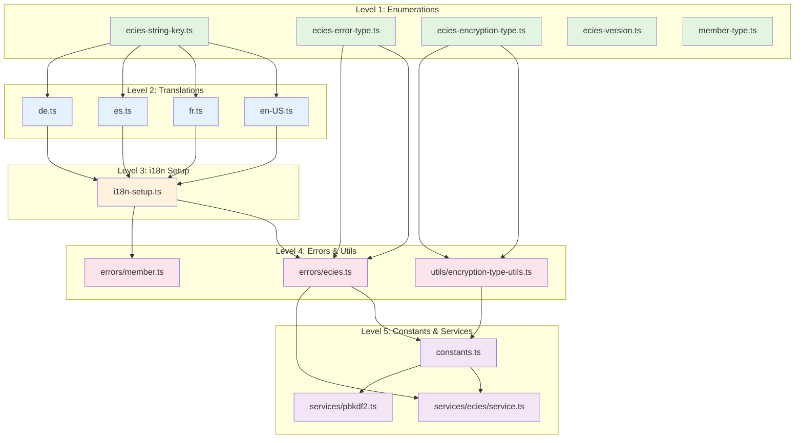

# Circular Dependency Prevention Guide

## Overview

This document describes the module dependency architecture of `@digitaldefiance/ecies-lib` and provides guidelines for preventing circular dependencies.

## Background

In version 4.2.x, the library experienced a circular dependency issue that caused `EciesStringKey` enum to be undefined at runtime during test execution, despite TypeScript compilation succeeding. This was caused by a circular import chain:

```
index.ts → constants.ts → enumerations → errors → i18n-setup → translations → enumerations
```

This guide documents the solution and provides rules to prevent similar issues in the future.

## Module Dependency Hierarchy

The library follows a strict 5-level hierarchical dependency structure:

### Level 1: Enumerations (Pure, No Dependencies)

**Location:** `src/enumerations/*.ts`

**Purpose:** Define TypeScript enums and type definitions

**Rules:**
- ✅ **CAN** import: TypeScript types only
- ❌ **CANNOT** import: Any other project modules
- ✅ **CAN** export: Enums, types, and simple constant maps

**Examples:**
- `ecies-string-key.ts` - Translation string keys
- `ecies-error-type.ts` - Error type enumerations
- `ecies-encryption-type.ts` - Encryption type enums and maps
- `ecies-version.ts` - Protocol version enums
- `member-type.ts` - Member type enumerations

**Pattern:**
```typescript
// ✅ GOOD: Pure enum with no imports
export enum EciesEncryptionTypeEnum {
  Simple = 33,
  Single = 66,
  Multiple = 99,
}

export type EciesEncryptionType = 'simple' | 'single' | 'multiple';

export const EciesEncryptionTypeMap: Record<EciesEncryptionType, EciesEncryptionTypeEnum> = {
  simple: EciesEncryptionTypeEnum.Simple,
  single: EciesEncryptionTypeEnum.Single,
  multiple: EciesEncryptionTypeEnum.Multiple,
};
```

```typescript
// ❌ BAD: Enum importing error class
import { ECIESError } from '../errors/ecies'; // Creates circular dependency!

export function validateType(type: EciesEncryptionTypeEnum): void {
  if (!isValid(type)) {
    throw new ECIESError(ECIESErrorTypeEnum.InvalidEncryptionType);
  }
}
```

### Level 2: Translations (Depends Only on Level 1)

**Location:** `src/translations/*.ts`

**Purpose:** Map enum keys to localized strings

**Rules:**
- ✅ **CAN** import: Enumerations (Level 1), external libraries
- ❌ **CANNOT** import: i18n setup, errors, constants, services
- ✅ **CAN** export: Translation objects

**Examples:**
- `en-US.ts` - English (US) translations
- `fr.ts` - French translations
- `es.ts` - Spanish translations
- `de.ts` - German translations

**Pattern:**
```typescript
// ✅ GOOD: Translation file importing only enumerations
import { EciesStringKey } from '../enumerations/ecies-string-key';

export const englishTranslations: Record<EciesStringKey, string> = {
  [EciesStringKey.Error_ECIESError_InvalidEncryptionType]: 'Invalid encryption type',
  [EciesStringKey.Error_ECIESError_DecryptionFailed]: 'Decryption failed',
  // ... more translations
};
```

```typescript
// ❌ BAD: Translation file importing i18n setup
import { getEciesI18nEngine } from '../i18n-setup'; // Creates circular dependency!
```

### Level 3: i18n Setup (Depends on Levels 1-2)

**Location:** `src/i18n-setup.ts`

**Purpose:** Initialize the internationalization engine

**Rules:**
- ✅ **CAN** import: Enumerations (Level 1), translations (Level 2), external libraries
- ❌ **CANNOT** import: Errors, constants, services
- ✅ **CAN** export: i18n engine accessor functions

**Pattern:**
```typescript
// ✅ GOOD: i18n setup importing enumerations and translations
import { EciesStringKey } from './enumerations/ecies-string-key';
import { englishTranslations } from './translations/en-US';
import { frenchTranslations } from './translations/fr';

export function getEciesI18nEngine(): PluginI18nEngine {
  // Initialize and return engine
}
```

```typescript
// ❌ BAD: i18n setup importing error classes
import { ECIESError } from './errors/ecies'; // Creates circular dependency!
```

### Level 4: Errors & Utilities (Depends on Levels 1-3)

**Location:** `src/errors/*.ts`, `src/utils/*.ts`

**Purpose:** Error classes and utility functions

**Rules:**
- ✅ **CAN** import: Enumerations (Level 1), i18n setup (Level 3), external libraries
- ❌ **CANNOT** import: Constants, services (except as lazy imports)
- ⚠️ **MUST** use lazy i18n initialization in error classes
- ✅ **CAN** export: Error classes, utility functions

**Examples:**
- `errors/ecies.ts` - ECIES error class
- `errors/member.ts` - Member error class
- `utils/encryption-type-utils.ts` - Encryption type validation utilities

**Pattern for Error Classes:**
```typescript
// ✅ GOOD: Error class with lazy i18n initialization
import { TypedHandleableError } from '@digitaldefiance/i18n-lib';
import { ECIESErrorTypeEnum } from '../enumerations/ecies-error-type';

export class ECIESError extends TypedHandleableError<ECIESErrorTypeEnum> {
  constructor(type: ECIESErrorTypeEnum, cause?: Error) {
    super(type, cause); // Don't access i18n in constructor
  }
  
  // Message is accessed lazily via getter when needed
  get message(): string {
    const engine = getEciesI18nEngine();
    return engine.translate(EciesComponentId, getKeyForType(this.type));
  }
}
```

```typescript
// ❌ BAD: Error class with eager i18n initialization
export class ECIESError extends Error {
  constructor(type: ECIESErrorTypeEnum) {
    const engine = getEciesI18nEngine(); // May not be initialized yet!
    super(engine.translate(EciesComponentId, getKeyForType(type)));
  }
}
```

**Pattern for Utility Functions:**
```typescript
// ✅ GOOD: Utility function in separate module
// src/utils/encryption-type-utils.ts
import { ECIESError } from '../errors/ecies';
import { ECIESErrorTypeEnum } from '../enumerations/ecies-error-type';
import { EciesEncryptionTypeEnum } from '../enumerations/ecies-encryption-type';

export function validateEciesEncryptionTypeEnum(
  type: EciesEncryptionTypeEnum,
): boolean {
  return Object.values(EciesEncryptionTypeEnum).includes(type);
}

export function ensureEciesEncryptionTypeEnum(
  type: EciesEncryptionTypeEnum,
): EciesEncryptionTypeEnum {
  if (!validateEciesEncryptionTypeEnum(type)) {
    throw new ECIESError(ECIESErrorTypeEnum.InvalidEncryptionType);
  }
  return type;
}
```

### Level 5: Constants & Services (Depends on Levels 1-4)

**Location:** `src/constants.ts`, `src/services/**/*.ts`

**Purpose:** Configuration constants and business logic

**Rules:**
- ✅ **CAN** import: All of the above levels
- ⚠️ **SHOULD** avoid circular dependencies with other services
- ⚠️ **MUST** handle early initialization errors gracefully in constants

**Examples:**
- `constants.ts` - Configuration constants
- `services/ecies/service.ts` - ECIES service
- `services/pbkdf2.ts` - PBKDF2 service

**Pattern for Constants:**
```typescript
// ✅ GOOD: Constants with safe error handling
import { EciesStringKey } from './enumerations/ecies-string-key';
import { getEciesI18nEngine } from './i18n-setup';

function safeTranslate(key: EciesStringKey, fallback: string): string {
  try {
    const engine = getEciesI18nEngine();
    return engine.translate(EciesComponentId, key);
  } catch {
    return fallback; // Use fallback during early initialization
  }
}

function validateConstants(config: IConstants): void {
  if (config.CHECKSUM.SHA3_BUFFER_LENGTH !== 32) {
    throw new Error(safeTranslate(
      EciesStringKey.Error_InvalidChecksum,
      'Invalid checksum constants'
    ));
  }
}
```

```typescript
// ❌ BAD: Constants with hard i18n dependency
function validateConstants(config: IConstants): void {
  const engine = getEciesI18nEngine(); // May fail during module init!
  if (config.CHECKSUM.SHA3_BUFFER_LENGTH !== 32) {
    throw new Error(engine.translate(EciesComponentId, EciesStringKey.Error_InvalidChecksum));
  }
}
```

## Dependency Graph Visualization



## Detection and Prevention

### Automated Detection

Use `madge` to detect circular dependencies:

```bash
# Install madge
npm install --save-dev madge

# Check for circular dependencies
npx madge --circular --extensions ts src/index.ts

# Check a specific module
npx madge --circular --extensions ts src/enumerations/index.ts

# Generate a visual dependency graph
npx madge --image graph.svg --extensions ts src/index.ts
```

### CI/CD Integration

Add circular dependency checks to your CI pipeline:

```yaml
# .github/workflows/ci.yml
- name: Check for circular dependencies
  run: |
    npx madge --circular --extensions ts src/index.ts
    if [ $? -ne 0 ]; then
      echo "❌ Circular dependencies detected!"
      exit 1
    fi
```

### Pre-commit Hooks

Add a pre-commit hook to catch issues early:

```bash
# .husky/pre-commit
#!/bin/sh
npx madge --circular --extensions ts src/index.ts
if [ $? -ne 0 ]; then
  echo "❌ Circular dependencies detected! Please fix before committing."
  exit 1
fi
```

### ESLint Rules

Consider using ESLint plugins to enforce import restrictions:

```json
{
  "rules": {
    "import/no-restricted-paths": [
      "error",
      {
        "zones": [
          {
            "target": "./src/enumerations",
            "from": "./src",
            "except": ["./enumerations"],
            "message": "Enumerations cannot import from other project modules"
          },
          {
            "target": "./src/translations",
            "from": "./src",
            "except": ["./enumerations", "./translations"],
            "message": "Translations can only import from enumerations"
          }
        ]
      }
    ]
  }
}
```

## Common Pitfalls and Solutions

### Pitfall 1: Validation Functions in Enumerations

**Problem:** Adding validation functions that throw errors directly in enumeration files.

**Solution:** Move validation functions to utility modules (Level 4).

### Pitfall 2: Eager i18n Initialization in Errors

**Problem:** Accessing i18n engine in error constructor.

**Solution:** Use lazy initialization via getter properties.

### Pitfall 3: Hard i18n Dependencies in Constants

**Problem:** Requiring i18n engine during module initialization.

**Solution:** Use safe translation helpers with fallback messages.

### Pitfall 4: Service-to-Service Circular Dependencies

**Problem:** Two services importing each other.

**Solution:** Apply dependency inversion principle, use interfaces, or refactor to a shared service.

## Testing Module Independence

The library includes property-based tests to verify module independence:

```typescript
/**
 * Property: Enumeration modules have no runtime dependencies
 */
test('enumerations can be imported without triggering other module loads', () => {
  fc.assert(
    fc.property(
      fc.constantFrom(
        'ecies-string-key',
        'ecies-error-type',
        'ecies-encryption-type'
      ),
      (enumFileName) => {
        jest.resetModules();
        const loadedModules = new Set<string>();
        
        // Track module loads
        jest.spyOn(global, 'require').mockImplementation((modulePath: string) => {
          loadedModules.add(modulePath);
          return originalRequire(modulePath);
        });
        
        require(`../enumerations/${enumFileName}`);
        
        // Verify no forbidden modules were loaded
        const forbiddenPatterns = [/translations\//, /i18n-setup/, /errors\//, /constants/];
        const forbiddenLoads = Array.from(loadedModules).filter(mod =>
          forbiddenPatterns.some(pattern => pattern.test(mod))
        );
        
        expect(forbiddenLoads).toHaveLength(0);
      }
    ),
    { numRuns: 100 }
  );
});
```

## Migration Guide

If you encounter circular dependencies in existing code:

1. **Identify the cycle** using `madge --circular`
2. **Determine the level** of each module in the hierarchy
3. **Move code** that violates the hierarchy:
   - Validation functions from enumerations → utilities
   - Error instantiation from enumerations → utilities
   - i18n access from constructors → lazy getters
4. **Update imports** to reference new locations
5. **Verify** with `madge` and tests

## References

- [Design Document](.kiro/specs/fix-ecies-circular-dependency/design.md)
- [Requirements Document](.kiro/specs/fix-ecies-circular-dependency/requirements.md)
- [Circular Dependency Report](.kiro/specs/fix-ecies-circular-dependency/circular-dependency-report.md)
- [Madge Documentation](https://github.com/pahen/madge)

## Conclusion

By following this hierarchical module structure and the associated rules, the library maintains a clean, acyclic dependency graph that ensures reliable initialization and prevents runtime errors from undefined values.

The key principles are:
1. **Enumerations are pure** - no dependencies
2. **Translations are data-only** - only import enumerations
3. **Errors use lazy i18n** - defer translation until message access
4. **Constants validate safely** - use fallback messages during initialization
5. **Services respect the hierarchy** - avoid circular dependencies

When in doubt, run `madge --circular` to verify your changes don't introduce cycles.
